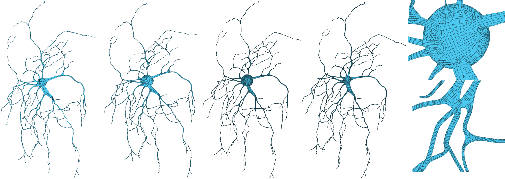

# QuadMeshTesser

**基于骨架驱动和可控卷积曲面约束的神经元四边形表面建模方法**

从 SWC 树形骨架生成以四边形为主、拓扑可检查的神经元膜网格：先显式扫掠与分叉/胞体衔接得到基网格，再经细分，并以可控卷积等值面约束顶点，在保持四边形连通关系的同时提高几何保真度。



*总体流程：SWC 预处理 → RMF 四边形扫掠 → 分叉/胞体衔接 → Catmull–Clark 细分 → 可控卷积等值面投影。*

## 功能

- **输入**：SWC 神经元形态（带半径的树状骨架）
- **输出**：四边形主导表面网格（OBJ，含四边面）
- **建网**：旋转最小化标架（RMF）截面扫掠、分叉 Y 型衔接、胞体球面约束与多区域水密拼接
- **优化**：Catmull–Clark 细分；可选将顶点投影到线骨架可控卷积场等值面
- **界面**：PyQt5 / qtpy + PyVista 参数面板与三维预览

## 安装

```bash
cd QuadMeshTesser
python -m pip install -r requirements.txt
python -m app.main
# 或双击 setup_and_run.bat / run.bat
```

依赖：`numpy`, `pandas`, `scipy`, `PyQt5`, `qtpy`, `pyvista`, `pyvistaqt`

> Windows 上若 PySide6 / PyQt6 出现 DLL 问题，本项目默认使用 **PyQt5**（通过 `qtpy`）。

启动后可从「快速示例」或「打开 SWC」加载数据（如 `data/Gol.swc`、`data/test_linear_0.swc`）。

## 主要参数

| 参数 | 说明 |
|------|------|
| 截面边数 | 截面多边形边数；**4** 为纯四边形扫掠 |
| Catmull–Clark 细分 | 细分层数，越大越光滑、顶点越多 |
| 半径缩放 | SWC 半径全局缩放 |
| 仅扫掠管道 | 只生成基网格，跳过细分与卷积投影 |
| SWC 预处理 | 消除节点球相交、短边异常等 |
| 逼近方式 | 卷积约束方式（如可控卷积 / 线积分 / 仅细分等） |
| 核函数 | `quartic`（有限支撑）/ `cauchy` |
| 等值 iso | 目标等值面 \(F=T\) |
| 投影到等值面 | 将细分顶点迭代投影到卷积曲面 |

## 方法要点

- **骨架驱动显式建网**：RMF 扫掠管壁，分叉处 Y 型条带或凸包过渡，胞体球面与一级分支衔接，边占用检查保证水密流形。
- **可控卷积约束**：由同一套骨架与半径生成融合场；有限/可变支撑抑制过度混合；细分后沿场梯度将顶点拉回等值面，减轻纯细分带来的胀缩。
- **四边形主导**：便于继续细分、编辑与后续仿真前处理。

## 目录结构

```
QuadMeshTesser/
  app/              # GUI
  quadmeshtesser/   # 核心库
  data/             # 示例 SWC / 参考网格
  scripts/          # 测试与基准脚本
  workflow.png      # 流程图
```

## 命令行调用示例

```python
from pathlib import Path
from quadmeshtesser import TreeQuadPipeline, PipelineParams

result = TreeQuadPipeline(
    PipelineParams(subdiv_levels=2, project=True, sweep_only=False)
).run(Path("data/test_linear_0.swc"))
print(result.mesh.n_vertices, result.mesh.n_quads)
```
